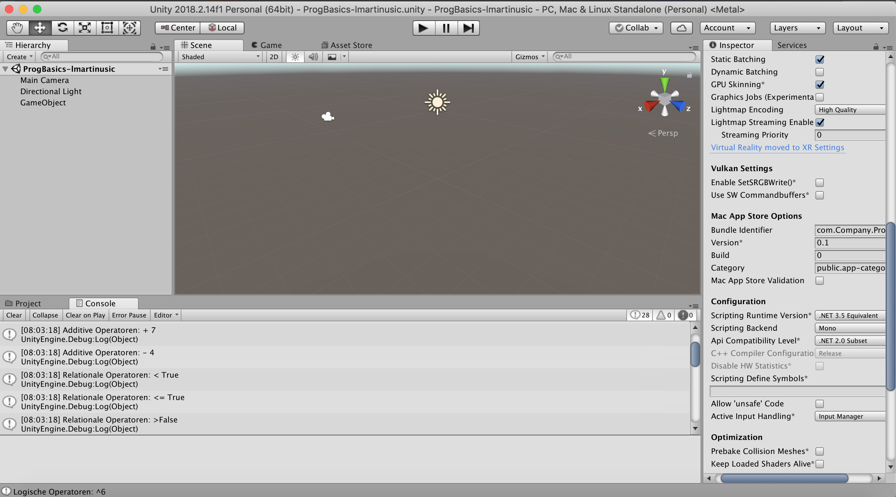

# ProgBasics-lmartinusic

Progress: 100%

Development Platform
-OS: macOS Mojave Version 10.14.3
-Unity: Version 2018.2.14f1
-Visual Studio Code: Version 1.33.0 
-Scripting Runtime Version: .NET 3.5 Equivalen
-API Compatibility Level: .NET 2.0 Subs

Erste Tests mit Operatoren
Mit Debug.Log in einem C# Script wurden diverse Multiplikative, Additive, Relationale, Gleichheits und Logische Operatoren in die Unity Console geprintet.

<h1>Screenshot</h1>

