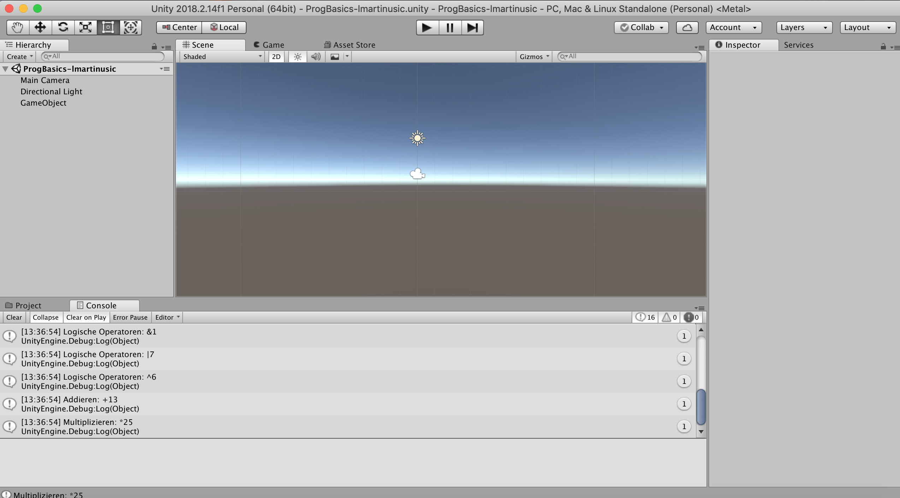

# ProgBasics-lmartinusic

<h5>Progress:</h5> 100%

<h5>Development Platform</h5>

-OS: macOS Mojave Version 10.14.3

-Unity: Version 2018.2.14f1

-Visual Studio Code: Version 1.33.0 

-Scripting Runtime Version: .NET 3.5 Equivalen

-API Compatibility Level: .NET 2.0 Subs

Erste Tests mit Operatoren
Mit Debug.Log in einem C# Script wurden diverse Multiplikative, Additive, Relationale, Gleichheits und Logische Operatoren in die Unity Console geprintet.

<h5>Screenshot</h5>

